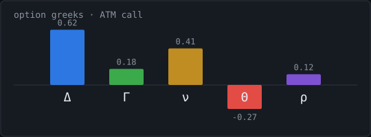
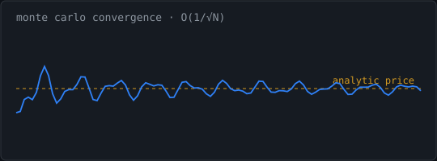
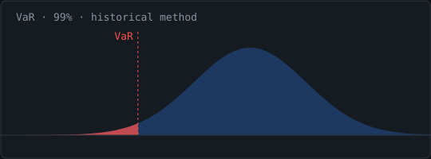
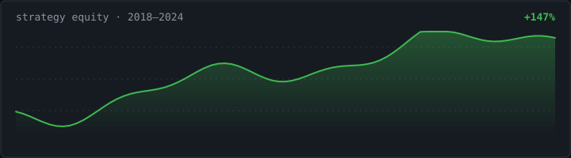

# Himadri Roy

**Doctor of Philosophy in Physics, Indian Institute of Technology Kanpur**
**Chartered Financial Analyst, Level One (Passed)**

Quantitative Researcher and Model Validator | Physics PhD transitioning into Quantitative Finance

**Seeking:** quantitative research and model validation roles within institutional finance.

**Geography:** open to relocation, with particular interest in London, New York, and Singapore.

[LinkedIn](https://linkedin.com/in/himadriroyiitk) · [Electronic Mail](mailto:himadri027roy@gmail.com) · [InspireHEP](https://inspirehep.net/authors/1969274) · [Repository](https://github.com/himadri027roy/quant-finance-portfolio)

  
  

  
  

## Professional Summary

A quantitative researcher with seven years of doctoral and postdoctoral training in high-energy physics, presently engaged in the structured validation of large language model outputs at Turing and transitioning into quantitative finance. The mathematical foundations of doctoral research—stochastic processes, the numerical solution of parabolic partial differential equations, and large-scale Monte Carlo simulation—correspond directly to the analytical apparatus underpinning derivatives valuation, risk measurement, and time-series analysis within institutional finance. The Black–Scholes–Merton equation, governing the no-arbitrage value of contingent claims under the risk-neutral measure, exemplifies this methodological correspondence:

$$\frac{\partial V}{\partial t} + \tfrac{1}{2}\sigma^{2} S^{2} \frac{\partial^{2} V}{\partial S^{2}} + r S \frac{\partial V}{\partial S} - r V = 0$$

The transition into quantitative finance is supported by formal credentialing through the Chartered Financial Analyst programme, by the Research Analyst certification administered under the regulatory framework of the Securities and Exchange Board of India, and by an active programme of applied implementation in derivatives pricing, risk measurement, and portfolio optimisation.

---

## Profile at a Glance

| Publications | Doctoral Tenure | Chartered Financial Analyst | Professional Objective |
|:---:|:---:|:---:|:---:|
| **5** peer-reviewed | **7** years | **Level I** passed | Quantitative research |
| *Nuclear Physics B*, *EPJC* | numerical and stochastic methods | Level II in preparation | and model validation |

---

## Current Engagement: Independent Model Validation

**Artificial Intelligence Training Specialist (Physics), Turing** — *June 2025 to present; promoted to full-time effective January 2026.*

Conducting structured and independent validation of analytical and numerical outputs produced by frontier large language models. Responsibilities encompass the evaluation of quantitative problem solutions against three distinct criteria—mathematical correctness, internal logical consistency, and conformity with established theoretical principles—and the documentation of validation findings within standardised reporting frameworks intended to support iterative model refinement. The role further involves the design of testing benchmarks calibrated to assess model stability under variation in input conditions and to identify systematic failure modes under adversarial perturbation, alongside the development of domain-specific evaluation datasets through original code drawing upon the methodological perspective of physics research.

---

## Quantitative Finance Portfolio (in active development)

The repository [`quant-finance-portfolio`](https://github.com/himadri027roy/quant-finance-portfolio) constitutes a structured programme of applied learning undertaken in support of my transition into quantitative finance. The implementations are developed from first principles, calibrated against canonical results in the academic literature, and documented progressively to a standard appropriate for technical review. The work is ongoing rather than finalised, and its evolution may be tracked through the repository's commit history.

The portfolio addresses five foundational components of contemporary quantitative finance:

- **Derivatives pricing** — Black–Scholes–Merton valuation under the risk-neutral measure, with the complete sensitivity suite (Delta, Gamma, Vega, Theta, Rho) and a Newton–Raphson solver for the extraction of implied volatilities from observed option premia, with explicit attention to the numerical instabilities that arise as vega degenerates near expiry and at-the-money.

- **Monte Carlo simulation** — valuation of European and path-dependent Asian options under antithetic-variate variance reduction, accompanied by convergence diagnostics intended to verify empirically the canonical $\mathcal{O}(1/\sqrt{N})$ error scaling characteristic of unbiased estimators under integrable distributions.

- **Systematic backtesting** — vectorised evaluation of four candidate trading strategies under realistic transaction-cost assumptions, with explicit engagement of the in-sample fit versus out-of-sample robustness trade-off and the diagnostic assessment of overfitting and regime sensitivity.

- **Risk measurement** — Value-at-Risk and Expected Shortfall estimators implemented under the historical, variance–covariance parametric, and Monte Carlo methodologies, with backtesting validation through the Kupiec proportion-of-failures unconditional-coverage test, and a planned extension toward the Christoffersen conditional-coverage methodology to address exception clustering.

- **Portfolio optimisation** — Markowitz mean–variance allocation subjected to scenario-based stress testing across the Global Financial Crisis of 2007–2009, the COVID-19 dislocation of March 2020, and interest-rate-shock regimes, with a planned extension toward the Black–Litterman posterior-blending framework and risk-parity allocation in order to address the documented limitations of the unmodified mean–variance construction.

Components are at varying stages of development. The decision to present the portfolio in its in-progress state, rather than to defer publication until completion, reflects a commitment to transparent professional self-presentation: the work is genuine and ongoing, and its trajectory is intended to be evaluable in real time.

---

## Active Research: Multi-Agent Equity Consistency Audit

A deterministic solver has been implemented for the *AlphaAgents* multi-agent equity portfolio construction framework introduced by Lee and collaborators (2025; arXiv:2508.11152), in which specialist valuation, fundamental, and sentiment agents arrive at consensus equity recommendations through structured debate under heterogeneous risk profiles. The solver reconstructs the complete audit chain from role-restricted evidence to agent reports, debate consensus, risk-profile behaviour, and realised portfolio performance, employing the Python scientific stack—pandas, NumPy, mpmath, statsmodels, networkx, and cvxpy—to implement econometric diagnostics, graph-theoretic analysis of debate logs, and convex projection under volatility-consistency constraints. The implementation is verified against forty deterministic test cases addressing claim-status classification, debate-validity reconstruction, portfolio-metric computation, risk-profile monotonicity assessment, and convex-optimisation consistency.

This work substantiates an explicit interest in the validation of agentic financial models through concrete implementation. The methodological challenge of validating multi-agent systems—which exhibit emergent behaviours not present in the constituent agents and whose evidentiary chains involve role-restricted information access—represents one of the more substantively interesting frontiers in contemporary model risk management, and constitutes the area in which technical experience and emerging financial expertise converge most directly.

---

## Credentials and Certifications

**Chartered Financial Analyst, Level One** (Passed). The curriculum encompasses ethical and professional standards, quantitative methods, economics, financial statement analysis, corporate issuers, equity investments, fixed income, derivatives, alternative investments, and portfolio management. Level Two presently in preparation.

**National Institute of Securities Markets, Series Fifteen — Research Analyst Certification**, recognised under the regulatory framework of the Securities and Exchange Board of India.

---

## Technical Foundation

**Programming and tooling:** Python (NumPy, pandas, SciPy, scikit-learn, Matplotlib, statsmodels, networkx, cvxpy, mpmath); C++; LaTeX.

**Quantitative methods:** Monte Carlo simulation; stochastic differential equations (geometric Brownian motion and more general formulations); finite-difference methods; numerical solution of partial differential equations; constrained convex optimisation.

**Statistics and machine learning:** hypothesis testing; Bayesian inference; regression analysis; time-series modelling within the autoregressive moving-average family; supervised and unsupervised learning.

**Finance:** derivatives pricing; Greek sensitivities; fixed-income analytics; modern portfolio theory; Value-at-Risk, Conditional Value-at-Risk, and Expected Shortfall.

---

## Selected Publications

Five peer-reviewed publications in *Nuclear Physics B* and the *European Physical Journal C*, addressing topics in beyond-the-Standard-Model phenomenology including resonant leptogenesis, heavy-neutrino searches at multi-tera-electron-volt muon colliders, and gravitational-wave signatures of first-order phase transitions in dark-matter scenarios. The complete bibliographic record is available through [InspireHEP](https://inspirehep.net/authors/1969274). The publications collectively demonstrate sustained capacity for independent quantitative research, the production of technical documentation to peer-reviewed standard, and substantive engagement with computationally demanding methodological problems.

---

## Closing

I am presently positioned at a point of professional transition that combines substantive prior training in mathematical and computational methods, a current engagement in independent validation work, formal credentialing in finance, and an active programme of applied implementation in quantitative finance. I welcome approaches from recruiters and hiring managers whose mandates align with the analytical and methodological orientation articulated above.
